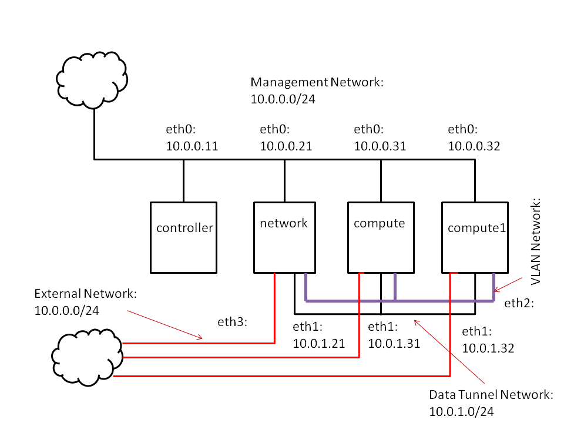

# openstack-mitaka-installer
The "OPSInstaller" OpenStack Mitaka Installation Script 

Copyright 2016 Kasidit Chanchio, Vasinee Siripoon, Somkiat Kosolsombat 

Contact: kasiditchanchio@gmail.com  
department of computer science  
faculty of science and technology  
Thammasat University.

NOTE: This "compact" version only run on 3 openstack nodes: controller, network and compute.
We create this version in order to try to install OpenStack mitaka on a notebook that has 
only 8GB Ram. So, we will ignore the "compute1" node in the original branch.  In the 
file "install-paramrc.sh", please leave parameters related to compute1 be as defined 
in the original example parameter values. In other words, don't touch the following 
parameters. Just leave it there to make the srcipt run properly. We will not use any of it anyway.
<pre>
#
# ---- compute1 host ----
#
export COMPUTE1_IP=10.0.0.32
export COMPUTE1_IP_NIC=eth0
export DATA_TUNNEL_COMPUTE1_NODE_IP=10.0.1.32
export DATA_TUNNEL_COMPUTE1_NODE_IP_NIC=eth1
export VLAN_COMPUTE1_NODE_IP_NIC=eth2
#
</pre>  
Then follow the original instructions below to install OpenStack. 

Also, if you want to do the OpenStack OpenDayLight integration, you probably have to 
use ODL controller outside the installation host (due to insufficient memory). 

You will issue every instruction on the controller node
of your OpenStack deployment. 

First, login to the your openstack account on the controller node and invoke 
the following commands to obtain this OpenStack installer script. 
<pre>
$ cd $HOME
$ git clone https://github.com/kasidit/openstack-mitaka-installer --branch openstack-mitaka-compact-installer
$ cd openstack-mitaka-installer
</pre>

------------------ORIGINAL INSTRUCTIONS-----------------------

In our example, we follow the example
configuration parameters in the <a href="http://docs.openstack.org/mitaka/install-guide-ubuntu/">official installation manual (using ubuntu)</a> of 
openstack as illustrated in the picture below.  
  
From the figure, we use the same configuration as those of OpenStack installation 
manual for the managment network, data tunnel network, v-lan network, and external network.
However, this script still require the followings. 
<ul>
<li> The name of the 4 hosts in the figure must be "controller", "network", "compute",
and "compute1". </li>
<li> The username of openstack account on every host must be the same. 
The password of those account must be the same across the hosts as well 
(but can be different from the username).
<li> You should make sure that the time on the controller node is up-to-date before installation
</ul>
Based on the above configuration and requirements, modify ./install-paramrc.sh file by entering 
environment variables' values that fit your deployment. 
<pre>
$ vi ./install-paramrc.sh
</pre>

You may view an example of this file <a href="./install-paramrc.sh">here</a>. After that, run the script below to substitute the parameter values in the script 
template tar file (OPSInstaller-init.tar). <b>PLEASE RUN EVERY SCRIPT DESCRIBED HERE AS 
A USER. DO NOT USE SUDO TO RUN THE SCRIPTS!</b> 

<pre>
$ ./exe-config-installer.sh
</pre>

After running the script, you should see a new directory "OPSInstaller" being created. 
This directory contains all scripts and configuration files that will later be run on every node 
to install OpenStack. The details of every script in the "OPSInstaller" can be seen in the 
<pre>
OPSInstaller/scriptmap.html
</pre> 
file. To view this file, you may have to copy the whole "OPSInstaller" directory out from the 
controller to your PC and use a browser to view the file. You may also take a look at an example of the scriptmap.html file in "documents/OPSInstaller.example" directory. An exampe  scriptmap.html file is also available at <a href="http://vasabilab.cs.tu.ac.th/presentations/OPSInstaller.example/scriptmap.html">http://vasabilab.cs.tu.ac.th/presentations/OPSInstaller.example/scriptmap.html</a>. 

<strong><u>
1. install OpenStack mitaka with classic open vswitch network
</u></strong>

On the controller node. 
<pre>
$ cd $HOME
$ cd openstack-mitaka-installer
$ cd OPSInstaller/installer
$ ./OS-installer-00-1...(please fill in the rest of the name)
$ ./OS-installer-00-2...
</pre>

The last script will reboot all hosts. You have to login to the controller node again and make sure that every other node is up before continue the installation. 
<pre>
$ cd $HOME
$ cd openstack-mitaka-installer
$ cd OPSInstaller/installer
$ ./OS-installer-01-...
$ ./OS-installer-02-...
$ ./OS-installer-03-...
$ ./OS-installer-04-...
$ ./OS-installer-05-...
$ ./OS-installer-06-...
$ ./OS-installer-07-...
$ ./OS-installer-08-...
(skip ./OS-installer-09-...)
$ ./OS-installer-10-...
</pre>

<strong><u>
2. Install OpenStack mitaka and deploy 
Distributed Virtual Router (DVR) network
</u></strong>

<pre>
$ cd $HOME
$ cd openstack-mitaka-installer
$ cd OPSInstaller/installer
$ ./OS-installer-00-1...(please fill in the rest of the name)
$ ./OS-installer-00-2...
</pre>

The last script will reboot all hosts. You have to login to the controller node again and make sure that every other node is up before continue the installation. 
<pre>
$ cd $HOME
$ cd openstack-mitaka-installer
$ cd OPSInstaller/installer
$ ./OS-installer-01-...
$ ./OS-installer-02-...
$ ./OS-installer-03-...
$ ./OS-installer-04-...
$ ./OS-installer-05-...
$ ./OS-installer-06-...
$ ./OS-installer-07-...
$ ./OS-installer-08-...
$ ./OS-installer-09-...
$ ./OS-installer-10-...
</pre>

<strong><u>
2. OpenStack mitaka and OpenSayLight Beryllium Integration 
</u></strong>

This installation package also contains a set of scripts for 
OpenStack mitaka and OpenDayLight (ODL) Beryllium integration.  
If you want to run it, the scripts assume you already have OpenStack 
with classic open vswitch network deployed. 

However, before the integration you have to delete all instances, 
routers, and networks from your OpenStack deployment. 
Make sure the ODL host is running and necessary ODL features 
are installed. You may consult our <a href="http://sciencecloud-community.cs.tu.ac.th/?p=238">
OpenStack and OpenDayLight integration blog post</a> or youtube videos in [4] for more details.  
When ready, run the following commands. 

<pre>
$ cd $HOME
$ cd openstack-mitaka-installer
$ cd OPSInstaller/installer
$ ./OSODL-ovs-00-...
$ ./OSODL-ovs-01-...
$ ./OSODL-ovs-02-...
$ ./OSODL-ovs-03-...
$ ./OSODL-ovs-04-...
$ ./OSODL-ovs-05-...
$ ./OSODL-ovs-06-...
$ ./OSODL-ovs-07-...
</pre>

Note: This script is written for educational purpose. 

For more information, please consult the following 
documents: 

1. http://sciencecloud-community.cs.tu.ac.th/ 
2. http://vasabilab.cs.tu.ac.th/ 
3. http://docs.openstack.org/
4. <a href="https://www.youtube.com/playlist?list=PLmUxMbTCUhr4tJhdkREiJdIMJo-P-vX2M">OpenStack Mitaka installation with Distributed Virtual Router videos</a>
5. <a href="https://www.youtube.com/playlist?list=PLmUxMbTCUhr4bjpV3ysL6_G_tokfpNyDb">OpenStack and OpenDayLight integration youtube videos</a>
 
